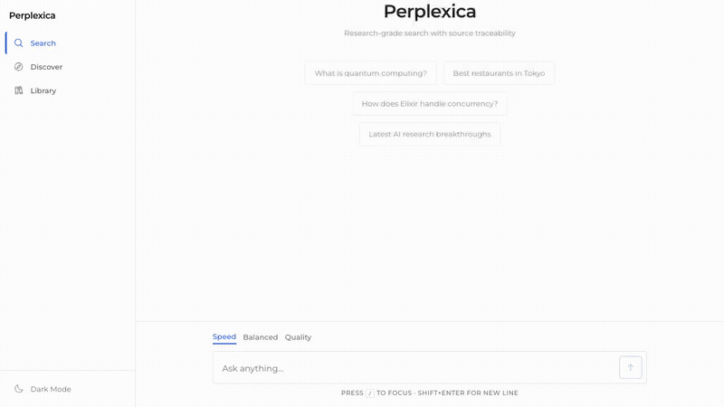
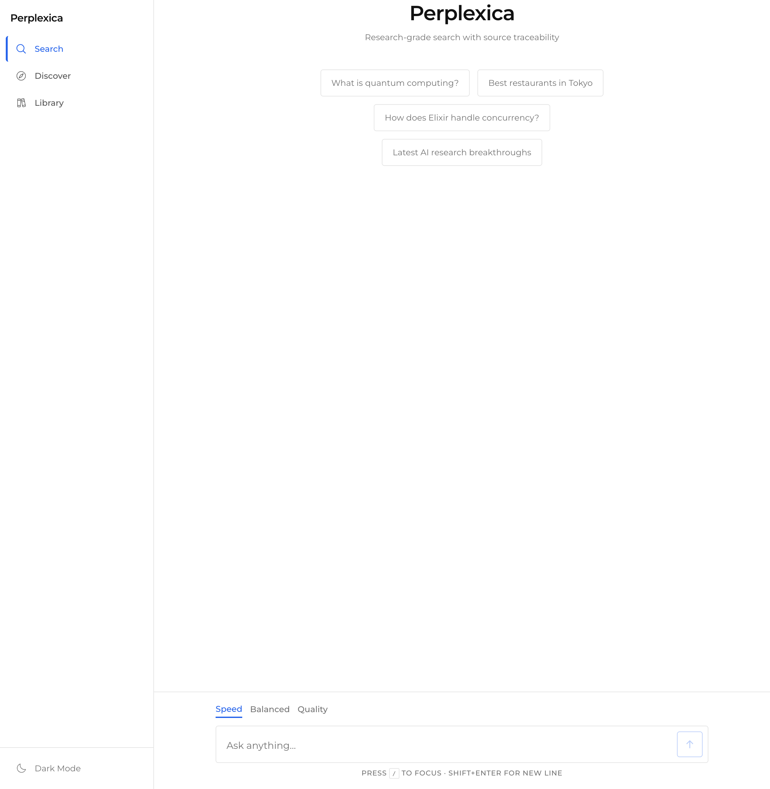
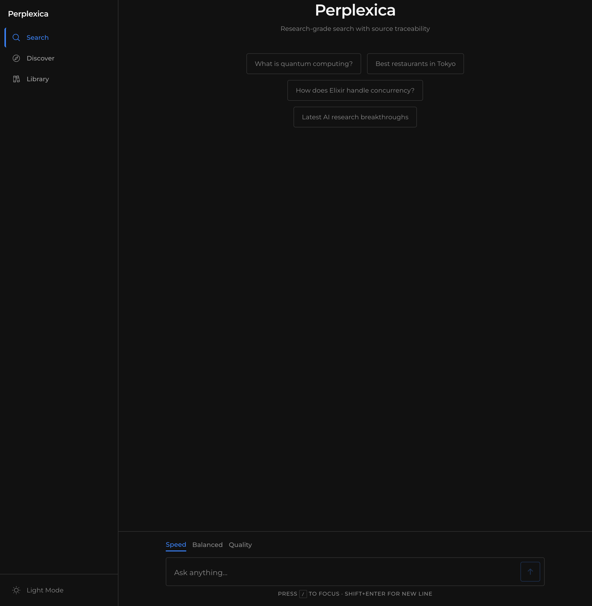
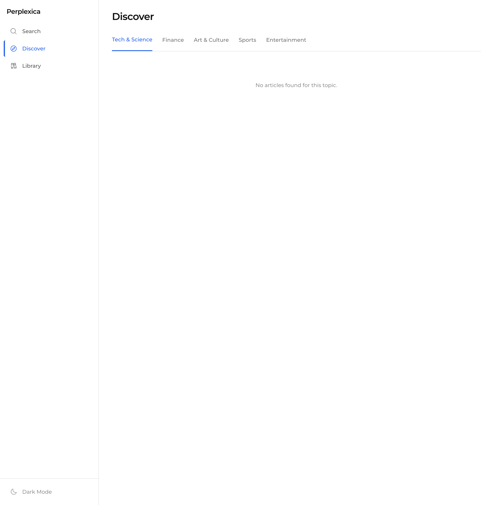
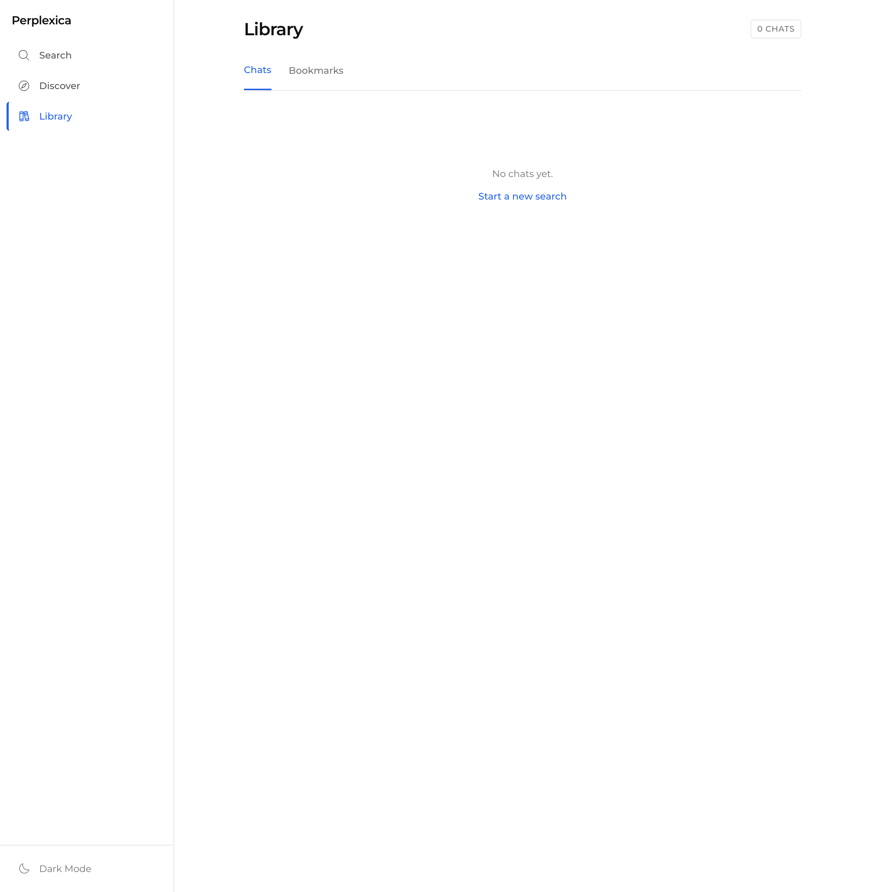

<div align="center">

# Perplexica



### Research-Grade AI Search

[]()
[]()
[]()
[]()

[Live Demo](https://perplexica-search.fly.dev/index.html)

</div>

---

A self-hosted, privacy-focused alternative to Perplexity AI. Uses an agentic research loop with Brave Search API and NVIDIA NIM large language models to deliver cited, source-traceable answers.

Built with **RedwoodJS** (React frontend) + **Elixir/Phoenix** (fault-tolerant backend) + **PostgreSQL** (persistent data with pgvector embeddings).

> Based on [ItzCrazyKns/Perplexica](https://github.com/ItzCrazyKns/Perplexica), rewritten as a resilient multi-service architecture with a neuroscience-based design system.

---

## Table of Contents

- [What It Is](#what-it-is)
- [Why It Exists](#why-it-exists)
- [How It Works](#how-it-works)
- [Screenshots](#screenshots)
- [Features](#features)
- [Design System](#design-system)
- [Architecture](#architecture)
- [Tech Stack](#tech-stack)
- [Setup](#setup)
- [Project Structure](#project-structure)
- [Audit Results](#audit-results)
- [Database Schema](#database-schema)
- [Progress Ledger](#progress-ledger)
- [License](#license)

---

## What It Is

Perplexica is an AI-powered search engine that doesn't just return links -- it reads, analyzes, and synthesizes information from the web into cited answers. Every claim links back to its source with inline citation badges `[1][2]`, and you can expand any source card to see exactly what text the AI extracted.

Think Google Scholar meets ChatGPT, but self-hosted, privacy-first, and with full source traceability.

## Why It Exists

Most AI search tools are black boxes. You ask a question, get an answer, and have no idea where it came from or whether it's accurate. Perplexica solves this by:

1. **Showing its work** -- every source is visible, expandable, and linkable
2. **Running on your infrastructure** -- no data sent to third parties beyond the search and AI APIs you configure
3. **Being fault-tolerant** -- each search runs in an isolated Elixir GenServer. One crash doesn't take down the system
4. **Failing over gracefully** -- if NVIDIA NIM goes down, it automatically switches to Zhipu GLM

## How It Works

```
User types query
    |
    v
[1. CLASSIFY] -- Determine query type, skip search if unnecessary
    |
    v
[2. RESEARCH] -- Agentic loop: search web, scrape pages, reason, repeat
    |            Speed: 2 iterations | Balanced: 6 | Quality: 25
    |            Real-time progress via WebSocket: "Searching (3 sources)..."
    v
[3. SYNTHESIZE] -- Generate answer with inline citations [1][2][3]
    |
    v
[4. DELIVER] -- Sources + answer + TOC + action bar (copy, share, bookmark, PDF, TTS)
```

**Real-time search progress**: When you submit a query, Perplexica connects via WebSocket and shows you exactly what's happening -- classifying your query, searching the web (with source count), analyzing sources, and writing the answer. No more staring at a spinner for 10 seconds.

**Agentic research loop**: The backend doesn't just do one search. It iterates -- searching, reading, reasoning, and searching again. In Quality mode, it can run up to 25 iterations, building a comprehensive understanding before answering.

**Source traceability**: Every source card shows the domain, title, and a citation badge. Click the badge in the answer to jump to the source. Expand "View extracted text" to see the raw content the AI used.

## Screenshots

### Light Mode -- Home


### Dark Mode -- Home


### Discover Page


### Library Page


> **Note**: For animated demos of the search flow and real-time progress indicators, see the [Live Demo](https://perplexica-search.fly.dev/index.html).

## Features

- **AI-Powered Web Search** -- Natural language queries with cited, source-traceable answers
- **Real-Time Search Progress** -- WebSocket-powered staged indicators: classifying, searching (N sources), analyzing, writing
- **Source Traceability** -- Expandable source cards with "View extracted text" for full transparency
- **Agentic Research Loop** -- Iterative search: Speed (2 iterations), Balanced (6), Quality (25)
- **Fault-Tolerant Backend** -- Each search in its own supervised Elixir GenServer with crash isolation
- **AI Provider Failover** -- NVIDIA NIM primary, Zhipu GLM fallback. Circuit breaker: 3 failures, 60s cooldown
- **Discover Page** -- Topic-based news feed (Tech, Finance, Art, Sports, Entertainment)
- **Library** -- Chat history + bookmarks with delete confirmation
- **Shared Links** -- Share any answer via `/s/{slug}` read-only URL
- **Answer Actions** -- Copy, Share, Bookmark, PDF Export, Text-to-Speech
- **Table of Contents** -- Auto-generated from answer headings with scroll tracking
- **Light & Dark Mode** -- Light-first design, dark mode toggle, system preference detection
- **Mobile Responsive** -- Bottom nav on mobile, sidebar on desktop, 44px touch targets
- **GraphQL API** -- Absinthe schema with queries, mutations, and WebSocket subscriptions
- **pgvector Embeddings** -- 1024-dim NV EmbedQA vectors for uploaded file search
- **XSS Protection** -- DOMPurify sanitization on all rendered markdown
- **WCAG 2.1 AA** -- Color contrast 4.85:1, ARIA live regions, skip-to-content, keyboard navigation
- **Lighthouse 100/100/100** -- Perfect scores: Accessibility, Best Practices, SEO

## Design System

Perplexica uses a **neuroscience-based design system** inspired by Linear and Vercel, tailored for researchers and scientists.

### Visual DNA

| Principle | Implementation |
|-----------|---------------|
| **1px outlines** | Every container defined by its border, never by a fill |
| **Color spine** | 3px left-border accent (blue) on cards and active nav items |
| **Text-link actions** | No button backgrounds -- just icon + text that responds to hover |
| **Outlined human icons** | Phosphor Icons (`weight="light"`) for navigation |
| **Whisper fill** | 3% opacity tint on hover/active states only |
| **8px grid** | All spacing multiples of 8 |

### Cognitive Science Principles Applied

- **Fitts's Law** -- 44px minimum touch targets, frequent actions in thumb zones
- **Hick's Law** -- 3 search modes (Speed/Balanced/Quality), 3 nav items
- **Miller's Law** -- Max 4 source cards visible before "Show more"
- **Gestalt Proximity** -- Related elements grouped, unrelated elements spaced
- **Von Restorff Effect** -- Active states use accent color spine, visually distinct

### Motion

- All animations < 300ms (Emil Kowalski rules)
- `ease-out` for entering elements, `ease-in-out` for morphing
- Staggered reveals on source cards and list items (50ms between)
- `prefers-reduced-motion` respected globally (CSS + JS)

### Typography

Montserrat with 7-step scale on an 8px baseline: Display (32), H1 (24), H2 (20), H3 (16), Body (15), Small (13), Caption (11). `-webkit-font-smoothing: antialiased`, `text-wrap: balance` on headings, `text-wrap: pretty` on body.

## Architecture

```
User Browser
    |
    |  GraphQL + WebSocket Subscriptions
    v
RedwoodJS (Vercel)
    |  React UI + Tailwind + Phosphor Icons
    |  Design system: SpineCard, TextAction, OutlineButton, CitationBadge
    |  Real-time: phoenix-ws.ts -> Absinthe Socket -> PubSub events
    |
    |  HTTPS / WSS
    v
Phoenix/Elixir (Railway)
    |  Absinthe GraphQL API
    |  SearchSupervisor (DynamicSupervisor)
    |    +-- SearchSession [GenServer] (per search, crash-isolated)
    |  ModelRegistry [GenServer]
    |    +-- NIM Provider (primary) --> NVIDIA NIM API
    |    +-- GLM Provider (fallback) --> Zhipu GLM API
    |  BraveSearch [Hammer rate limit] --> Brave Search API
    |
    v
PostgreSQL + pgvector
    9 tables: chats, messages, search_sessions, config,
    model_providers, uploads, upload_chunks, users,
    shared_links, bookmarks
```

## Tech Stack

| Layer | Technology |
|-------|-----------|
| Frontend | RedwoodJS 8.9, React 18, Tailwind CSS 3, Framer Motion, GSAP |
| Design System | Phosphor Icons, SpineCard/TextAction/OutlineButton/CitationBadge |
| Backend | Elixir 1.19, Phoenix 1.8, Absinthe GraphQL |
| Real-Time | Phoenix Channels, Absinthe Subscriptions, @absinthe/socket |
| Database | PostgreSQL 17 + pgvector 0.8 (Ecto + Prisma) |
| AI Provider | NVIDIA NIM (OpenAI-compatible) + Zhipu GLM failover |
| Search | Brave Search API + Hammer rate limiting |
| Embeddings | NV EmbedQA E5 v5 (1024-dim, asymmetric) |
| Security | DOMPurify (XSS), CORS restricted, HSTS, focus-visible |
| Testing | Playwright (E2E), Chrome DevTools MCP (Lighthouse) |

## Setup

### Prerequisites

- Elixir 1.15+ and Erlang/OTP 26+
- Node.js 20 (use `mise` or `nvm`)
- PostgreSQL 14+ with pgvector extension
- NVIDIA NIM API key ([nvidia.com/nim](https://build.nvidia.com/explore/discover))
- Brave Search API key ([brave.com/search/api](https://brave.com/search/api/))

### Environment Variables

**Phoenix** (`phoenix/.env.local`):
```env
NVIDIA_NIM_API_KEY=your_nvidia_nim_api_key
BRAVE_SEARCH_API_KEY=your_brave_search_api_key
# Optional:
GLM_API_KEY=your_glm_api_key
GLM_BASE_URL=https://open.bigmodel.cn/api/paas/v4
```

**Redwood** (`redwood/.env`):
```env
DATABASE_URL=postgresql://user@localhost:5432/perplexica_dev
PHOENIX_URL=http://localhost:4000
```

### Running Locally

```bash
# 1. Set up database
createdb perplexica_dev
psql -d perplexica_dev -c "CREATE EXTENSION IF NOT EXISTS vector;"

# 2. Start Phoenix backend
cd phoenix
mix setup          # Install deps, create DB, run migrations
mix phx.server     # Starts on :4000

# 3. Start Redwood frontend (separate terminal)
cd redwood
yarn install
yarn rw dev web    # Starts on :8910
```

Open **http://localhost:8910** to use the app.

### Deploying

**Phoenix to Fly.io:**
```bash
cd phoenix
fly launch    # Auto-detects Dockerfile
fly secrets set NVIDIA_NIM_API_KEY=... BRAVE_SEARCH_API_KEY=... SECRET_KEY_BASE=$(mix phx.gen.secret)
```

**Redwood to Vercel:**
```bash
cd redwood
# Connect repo to Vercel, set root directory to "redwood"
# Set env var: PHOENIX_URL=https://your-app.fly.dev
```

## Project Structure

```
perplexica/
+-- phoenix/                        # Elixir/Phoenix backend
|   +-- lib/perplexica/
|   |   +-- models/                 # AI providers (NIM, GLM, registry, failover)
|   |   +-- search/                 # Pipeline (classifier, researcher, actions, session)
|   |   +-- search_sources/         # Brave Search client + rate limiter
|   |   +-- chat.ex, message.ex     # Ecto schemas
|   |   +-- shared_link.ex          # Shared answer links
|   |   +-- bookmark.ex             # Answer bookmarks
|   +-- lib/perplexica_web/
|   |   +-- schema.ex               # Absinthe GraphQL root (queries, mutations, subscriptions)
|   |   +-- resolvers/              # Search, Chat, Provider, Share resolvers
|   |   +-- channels/               # WebSocket for Absinthe subscriptions
|   +-- priv/repo/migrations/       # Database migrations (source of truth)
|   +-- Dockerfile                  # Fly.io deployment
+-- redwood/                        # RedwoodJS frontend
|   +-- web/src/
|   |   +-- components/
|   |   |   +-- ui/                 # Design system: SpineCard, TextAction, OutlineButton...
|   |   |   +-- Chat/               # MessageBox, MessageInput, SearchProgress, AnswerActionBar, TOC
|   |   |   +-- Sources/            # Source cards with SpineCard styling
|   |   +-- pages/                  # Home, Discover, Library, Shared, NotFound
|   |   +-- layouts/                # AppLayout (sidebar + bottom nav + skip-to-content)
|   |   +-- lib/
|   |   |   +-- useSearch.ts        # Search hook (WebSocket subscriptions + polling fallback)
|   |   |   +-- phoenix-ws.ts       # Absinthe WebSocket client
|   |   |   +-- phoenix.ts          # GraphQL HTTP client
|   |   |   +-- motion.ts           # Animation primitives (timing, easing, variants)
|   |   |   +-- renderMarkdown.ts   # Markdown->HTML with DOMPurify XSS protection
|   |   |   +-- theme.tsx           # Light/dark mode provider
|   |   +-- index.css               # Design tokens (CSS custom properties), typography, reduced-motion
|   +-- web/config/tailwind.config.js  # Color tokens, grid areas, typography scale
|   +-- web/tests/                  # Playwright E2E tests
|   +-- web/playwright.config.ts    # Playwright configuration
+-- docs/
|   +-- audits/                     # Gate 0-4 Lighthouse + audit reports
|   +-- screenshots/                # UI screenshots for README
+-- openspec/                       # Architecture specs and proposals
```

## Audit Results

This codebase was audited through a 5-gate quality pipeline:

| Gate | What | Result |
|------|------|--------|
| **Gate 0** | Playwright baselines + Lighthouse pre-redesign | A11y 89, BP 100, SEO 91 |
| **Gate 1** | Design system foundation (tokens, grid, icons, motion, components) | 13 deliverables |
| **Gate 2** | Page overhaul (all pages + components redesigned) | 10 components |
| **Gate 3** | 6 parallel audits (UX Laws, Checklists, Security, Interaction, A11y, Perf) | 300+ items scored |
| **Gate 4** | Fix all findings + retest | **A11y 100, BP 100, SEO 100** |

### Lighthouse Before vs After

| Page | Accessibility | Best Practices | SEO |
|------|:------------:|:--------------:|:---:|
| Home (before) | 89 | 100 | 91 |
| Home (after) | **100** | **100** | **100** |
| Discover (after) | **100** | 96 | **100** |
| Library (after) | **100** | 96 | **100** |

### Security Fixes Applied
- DOMPurify XSS protection on all `dangerouslySetInnerHTML` usage
- CORS restricted from `["*"]` to localhost + production domain
- Font preconnect for critical path optimization
- ARIA live regions for screen reader announcements

Full audit reports in [`docs/audits/`](docs/audits/).

## Database Schema

10 tables in PostgreSQL:

| Table | Purpose |
|-------|---------|
| `chats` | Conversation threads |
| `messages` | Query-response pairs with JSONB response blocks |
| `search_sessions` | GenServer state checkpoints for crash recovery |
| `config` | Application configuration (key-value JSONB) |
| `model_providers` | AI provider configs (NIM, GLM) |
| `uploads` | File upload metadata |
| `upload_chunks` | Embedded text chunks with pgvector(1024) |
| `users` | Password auth (bcrypt) |
| `shared_links` | Shareable answer URLs with slug |
| `bookmarks` | Saved answers for quick access |

## Progress Ledger

See [PROGRESS.md](PROGRESS.md) for the complete development timeline.

## License

Same license as upstream [Perplexica](https://github.com/ItzCrazyKns/Perplexica).
