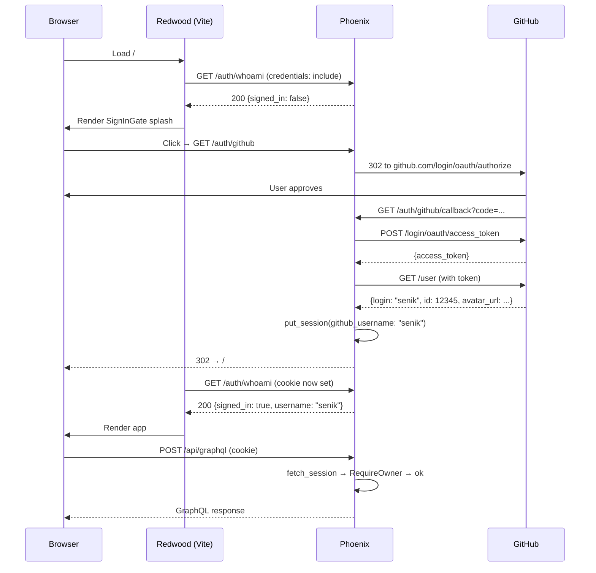

# Design — Add GitHub Auth Gate

## Context

Perplexica is a single-tenant self-hosted search app. The owner runs it on Fly.io and accesses it from their browser. Today any caller who finds the origin can issue GraphQL mutations, triggering paid upstream API calls (NIM, GLM, Brave, Exa) and reading private chat history. We need a gate that admits only the owner.

## Goals

1. Only a hardcoded GitHub username (configurable via env) can reach the GraphQL pipeline.
2. Sign-in flow is one click: "Sign in with GitHub" → GitHub OAuth → redirect back → app loads.
3. Sessions survive browser restarts but are revocable by rotating `PHOENIX_SESSION_SECRET_KEY_BASE`.
4. Health endpoint stays public.
5. No third-party auth-as-a-service (Clerk, Auth0) — keep auth in-stack.

## Non-Goals

- Multi-user support (one owner, maybe two with an allowlist).
- Role/permission system.
- Refresh tokens / access token management beyond what Ueberauth gives us out of the box.
- Storing user profiles in the database. The session IS the source of truth.

## Decisions

### Auth library: Ueberauth + ueberauth_github

Alternatives considered:
- **Clerk** (what `.env.local` hints at) — rejected: user management UI we don't need; third-party dependency; Vite env prefix mismatch with the publishable key; feels like overkill for a single user.
- **Assent** — modern Ueberauth alternative. Smaller and faster, but Ueberauth has the longer track record, more examples, and the GitHub strategy is battle-tested. Going with the boring choice.
- **Hand-rolled OAuth** — rejected: 50 lines of correctness-sensitive code for no benefit over Ueberauth's ~5 lines of config.

### Session storage: Plug.Session with cookie store

Cookies are encrypted + signed using `Phoenix.Token`/Plug's built-in cookie store. No server-side session table — the session blob rides in the cookie.

- **Why cookie store**: single-user app, no need for revocation-by-id, no scale concerns. Cookie signing salt + secret key base already part of Phoenix's standard config. Rotating the secret key base invalidates all sessions (emergency kill switch).
- **Not chosen**: Redis / ETS / DB session table — introduces a new dependency for a feature we don't need.
- **Cookie config**: `secure: true` in prod, `http_only: true`, `same_site: "Lax"` (Strict would break the GitHub redirect flow because the callback comes from github.com).
- **Max age**: 30 days. Long enough that the owner rarely re-signs-in; short enough that a stolen cookie has a bounded blast radius.

### Authorization: username allowlist in config

```elixir
# config/runtime.exs
config :perplexica, :github_allowlist,
  (System.get_env("GITHUB_ALLOWLIST") || "")
  |> String.split(",", trim: true)
  |> Enum.map(&String.downcase/1)
```

The `RequireOwner` plug lowercases the session username and compares. Case-insensitive because GitHub usernames are case-insensitive in practice.

Alternatives considered:
- Hardcoded username in the plug — rejected: changing owner requires a redeploy.
- GitHub user ID instead of username — more robust against username rename, but username is what the owner thinks in. We store both in the session; rename-survivability is a nice-to-have not a launch blocker.

### Plug order in the GraphQL pipeline

```
:cors
:accepts ["json"]
:fetch_session
:fetch_cookies
RequireOwner  # 401 / 403 fast path
RateLimit
put_secure_browser_headers
```

- CORS first so preflights never hit auth.
- `fetch_session` before `RequireOwner` (obvious — plug needs `conn.private[:plug_session]`).
- `RequireOwner` before `RateLimit` so unauthenticated abuse exhausts the plug-check budget, not our rate-limit counters.
- `put_secure_browser_headers` last — headers apply to the eventual response.

### Failure semantics

- **No session** → 401 JSON `{"error":"unauthenticated"}`.
- **Session with non-allowlisted username** → 403 JSON `{"error":"forbidden"}`.
- **Both cases return `Access-Control-Allow-Credentials: true`** so the frontend can surface the error without CORS masking it.

### Frontend session propagation

```ts
// redwood/web/src/lib/phoenix.ts
const httpLink = createHttpLink({
  uri: import.meta.env.VITE_GRAPHQL_URL,
  credentials: 'include', // ← session cookie travels with every call
})
```

The `SessionProvider` fetches `/auth/whoami` on mount with `credentials: 'include'`. Response shape:

```json
{"signed_in": true, "username": "senik", "avatar_url": "https://..."}
// or
{"signed_in": false}
```

`SignInGate` renders one of:
- Loading spinner while `whoami` is in flight.
- A full-page sign-in splash with the "Sign in with GitHub" button if `signed_in: false`.
- `children` if `signed_in: true` and the username is in the allowlist (frontend double-checks as a UX safeguard; backend is still the source of truth).

The sign-in button is an `<a href="/auth/github">` (plain anchor, not Link) so the browser performs a full-page navigation — required for the OAuth redirect dance.

### GraphQL pipeline failure mode

If an authenticated user's session is rejected by `RequireOwner` (e.g., rotated allowlist), Apollo sees a 403. The Apollo error link catches it and calls `SessionProvider.refresh()`, which re-fetches `whoami`, which returns `signed_in: false`, which flips `SignInGate` to the splash. Clean cycle, no infinite loop.

## Trade-offs

| Decision | Trade-off |
|---|---|
| Cookie session (no DB) | Simple; emergency revoke requires rotating secret base (kills all sessions at once). Acceptable for single-user. |
| Allowlist in env var | Easy to change without migration; one env change = redeploy. Fine. |
| No CSRF token on GraphQL | Session cookie is `SameSite=Lax`, which blocks cross-site POSTs from forms but allows top-level GETs. GraphQL uses POST, so Lax is sufficient. Not adding an explicit CSRF token layer — one layer is enough for single-user. |
| Long 30-day session | Owner convenience > stolen-cookie window. Can shorten later. |
| No refresh tokens | Ueberauth's GitHub strategy gives us a one-shot access token that we throw away after reading profile. We don't make GitHub API calls post-login, so there's nothing to refresh. |

## Diagram



## Open Questions

- **Do we gate the Redwood SPA HTML shell as well?** Currently `get "/*path", PageController, :index` serves the Vite-built SPA publicly. Decision: leave public. The HTML shell is static assets; the interesting data lives behind `/api/graphql` which IS gated. Public SPA is the standard pattern and simplifies the sign-in splash (the splash is just React, no server round-trip needed to render).
- **Rate-limit the auth endpoints themselves?** GitHub's OAuth endpoint is rate-limited upstream; our `/auth/github/callback` is one-hit-per-sign-in. Skipping an extra rate limit for now. Can revisit if logs show abuse.
