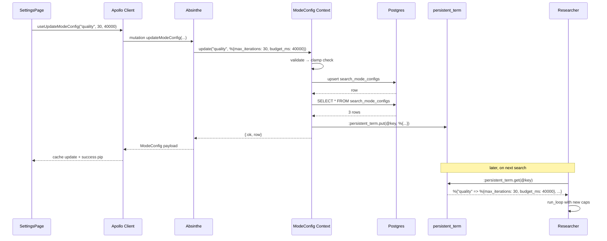

# Design — Add Search Mode Config

## Context

Research loop behavior is controlled by a single module attribute:

```elixir
# phoenix/lib/perplexica/search/researcher.ex:27-31
@max_iterations %{"speed" => 2, "balanced" => 6, "quality" => 25}
```

That's the only lever — no time budget, no per-mode model, no per-mode temperature. The owner wants to experiment with those knobs without shipping code. The minimum viable change is: make `max_iterations` editable, and add a soft time budget (`budget_ms`) so long-running research loops self-terminate even when they haven't hit the iteration cap.

## Goals

1. Per-mode `max_iterations` and `budget_ms` persisted in Postgres, editable via GraphQL.
2. Researcher reads both values at request time, with negligible overhead vs. the current module-attribute read.
3. Soft-budget semantics: when time runs out, the current iteration finishes cleanly and the loop exits with whatever results are in hand — no interrupt, no data loss.
4. UI in the settings page for tuning, gated by the existing auth plug.
5. Sensible defaults preserved: the first boot after migration has `{speed: 2/7000, balanced: 6/16000, quality: 25/35000}` — matching today's researcher and the frontend's budget hints.

## Non-Goals

- Per-mode model selection. (The `Models.Registry.chat_completion` call is global today; separating per-mode model is a distinct feature.)
- Per-mode temperature / max_tokens. Same reasoning.
- Hard interrupt of an in-flight LLM call when the budget expires. Interrupting mid-completion means losing whatever tokens the model was about to emit. Soft budget — "don't start another iteration after the timer runs out" — is simpler and honest about what we're buying.
- Multi-user config (each user gets their own knobs). Single-tenant app; one row per mode is enough.

## Decisions

### Storage: Postgres table, not env var

Alternatives:
- **Env var on Phoenix** (e.g. `MAX_ITERATIONS_BALANCED=6`) — changes require a redeploy. Defeats the "tune from UI" goal.
- **JSON file in the repo** — same problem as env vars plus merge conflicts.
- **Postgres table**. ← chosen. Editable at runtime, durable, cheap.

Schema:
```elixir
schema "search_mode_configs" do
  field :mode, :string           # "speed" | "balanced" | "quality"
  field :max_iterations, :integer
  field :budget_ms, :integer
  timestamps(updated_at: :updated_at, inserted_at: :inserted_at)
end
```

Unique index on `mode`. That's it — no row per user, no row per session.

### Read path: in-process cache

Every search request reads the config. Going to Postgres for three integers on every request is wasteful. Two cache options:

- **`Agent`** — explicit process, testable, restartable. Slight extra overhead per read (GenServer call).
- **`:persistent_term`** — zero read overhead, but writes copy the full term. For a 3-key map, write cost is trivial. Reads are literal CPU-cache hits.

Going with `:persistent_term`. Wrapper module `Perplexica.Search.ModeConfig` exposes:

```elixir
def get(mode),   do: Map.fetch!(:persistent_term.get(@key), mode)
def get_all(),   do: :persistent_term.get(@key)
def update(mode, attrs), do: ... Repo.insert_or_update ... |> refresh_cache()
def reset(mode), do: ... |> refresh_cache()
```

On application boot, `Perplexica.Application.start/2` calls `ModeConfig.warm_cache()` which reads the three rows from Postgres and puts them in `:persistent_term`. If the table is empty (first boot after migration), `warm_cache` seeds it from the defaults and then caches.

Failure mode: if Postgres is unreachable at boot, `warm_cache` falls back to `{speed: 2/7000, balanced: 6/16000, quality: 25/35000}` defaults and logs a warning. The researcher still works — it just can't tune.

### Write path and cache invalidation

Updates go through `ModeConfig.update/2`:

```elixir
def update(mode, attrs) do
  with {:ok, valid} <- validate(attrs),
       {:ok, row}   <- upsert(mode, valid) do
    refresh_cache()
    {:ok, row}
  end
end
```

Cache refresh re-reads from Postgres rather than patching the cached map — keeps the cache honest even if two nodes race (though this is a single-node deployment today).

Validation clamps:
- `mode ∈ {"speed", "balanced", "quality"}` — reject anything else
- `max_iterations ∈ [1, 50]` — 1 is "one shot, no loop"; 50 caps the worst-case API bill
- `budget_ms ∈ [1000, 120000]` — 1 second floor (otherwise the first iteration always exceeds it), 2-minute ceiling (otherwise quality mode can burn $5 per request)

Returns `{:error, [{field, reason}, ...]}` on validation failure so the resolver can surface field-level messages.

### Researcher budget integration

Current loop (simplified):

```elixir
defp run_loop(%{iteration: i, max_iterations: max} = state) when i >= max, do: {:ok, state.all_results}
defp run_loop(state) do
  case Registry.chat_completion(state.messages, opts) do
    {:ok, _, {:ok, response}} -> handle_response(state, response)
    ...
  end
end
```

Proposed loop:

```elixir
defp run_loop(%{iteration: i, max_iterations: max} = state) when i >= max, do: {:ok, state.all_results}
defp run_loop(%{started_at: started, budget_ms: budget_ms} = state) do
  elapsed = System.monotonic_time(:millisecond) - started
  if elapsed >= budget_ms do
    Logger.info("[Researcher] Soft budget (#{budget_ms}ms) exceeded after #{state.iteration} iterations")
    {:ok, state.all_results}
  else
    case Registry.chat_completion(state.messages, opts) do
      {:ok, _, {:ok, response}} -> handle_response(state, response)
      ...
    end
  end
end
```

`state.started_at` is set in `research/3` before the first loop call via `System.monotonic_time(:millisecond)`. `state.budget_ms` comes from `ModeConfig.get(mode).budget_ms`.

The check is _before_ each iteration — so the current iteration always finishes. If the budget expires mid-LLM-call, we eat the full cost of that call but exit before starting the next. That's the soft semantic.

### GraphQL surface

```graphql
type ModeConfig {
  mode: String!
  maxIterations: Int!
  budgetMs: Int!
}

extend type Query {
  modeConfigs: [ModeConfig!]!
}

extend type Mutation {
  updateModeConfig(mode: String!, maxIterations: Int!, budgetMs: Int!): ModeConfig!
  resetModeConfig(mode: String!): ModeConfig!
}
```

No separate authorization decorator — the `:api` pipeline already runs `RequireOwner` (from `add-github-auth-gate`), so any GraphQL mutation reaching the resolver is already owner-authenticated. Defense in depth would add a resolver-level check, but for a single-user app the one layer is enough.

Error shape from the resolver on validation failure:

```elixir
{:error,
  message: "validation failed",
  extensions: %{
    code: "validation_failed",
    fields: %{"budgetMs" => "must be between 1000 and 120000"}
  }}
```

Apollo surfaces this through an error link; the settings card shows the message under the offending field.

### Frontend card

The settings-page "Search Modes" card is a small component with three `ModeRow` children. Each `ModeRow`:

```
┌─────────────────────────────────────────────────┐
│ Balanced              Iterations [ 6  ▼▲]  ⟳   │
│ Two research rounds.  Budget     [16.0s▼▲]      │
└─────────────────────────────────────────────────┘
```

- Mode name + description on the left
- Two number spinners on the right (iterations as int, budget as decimal seconds → multiplied by 1000 on submit)
- A reset icon that calls `resetModeConfig`
- Debounced save (500ms after the last keystroke) via `useUpdateModeConfig` mutation
- Success pip: brief checkmark after save, 1.5s fade
- Error pip: inline red text under the offending field, cleared on next edit

Optimistic update: Apollo optimistic response with the posted values so the UI doesn't lag behind the debounce.

## Trade-offs

| Decision | Trade-off |
|---|---|
| Soft budget (not interrupt) | Simple, honest about LLM call indivisibility; can overshoot by one iteration's worth of time. |
| `:persistent_term` cache | Fast reads; writes copy the whole term (fine for 3-key map). Not suitable if we ever add per-user config. |
| Cache on boot + after writes only | One round-trip at boot; zero round-trips at read time. Stale-cache risk is zero on single-node deploy. |
| Validation bounds in code, not DB | Easier to change; DB-level `CHECK` constraints would duplicate the same clamps. |
| Single table row per mode (no history) | Simple; no audit trail of changes. Acceptable for single-user tuning. Audit logs table already exists (`audit_logs` migration) — could log writes there later. |
| No per-mode model/temperature | Out of scope; keeps the PR small. Deliberate. |

## Diagram



## Open Questions

- **Should we surface current usage (e.g., "last search used 17/25 iterations") on the card?** Answer: nice-to-have, deferred. Not needed for the initial ship; can add later by reading from the `audit_logs` table.
- **Hot-reload the cache on external DB writes?** Answer: no. The only writer is the resolver, and the resolver refreshes the cache after every write. If someone runs SQL against the table directly they can call `ModeConfig.warm_cache/0` from `iex` or restart the app.
- **What happens if a new mode gets added to the frontend (e.g. `"thorough"`) without a DB row?** Answer: `ModeConfig.get/1` falls back to the `balanced` defaults and logs a warning. The resolver's validation rejects writes to unknown modes, so the DB stays clean.
