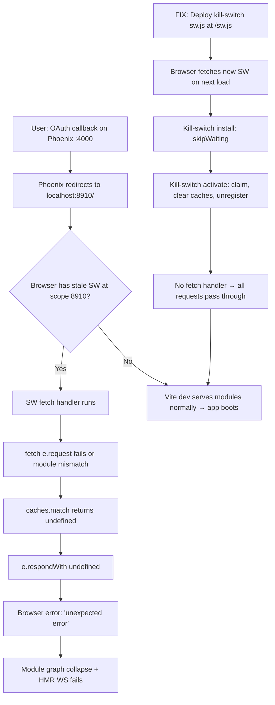

# Design — Kill Stale PWA Service Worker

## Context

A service worker registered during a retired Phoenix smoke-test phase is still resident in the user's browser at scope `http://localhost:8910/`. It intercepts every non-`/api/` GET and responds with `undefined` when both `fetch()` and `caches.match()` fail — breaking Vite HMR, module loading, and post-OAuth navigation. The repo no longer ships the originating HTML, but the SW persists because **service workers live in the browser, not the repo**. We cannot fix this by deleting files alone; we must evict the running SW from clients.



*Diagram: M01 (flowchart) — the bug pipeline and the recovery path.*

## Why a kill-switch SW instead of asking users to clear DevTools?

Three reasons:

1. **Recovery must be automatic.** Telling every user/tester "open DevTools → Application → Service Workers → Unregister" is unacceptable for a self-hosted single-user app and worse for any future sharable build. A kill-switch SW recovers every browser on the next page load with zero user action.
2. **Service workers can only be replaced by another service worker at the same URL.** A plain HTTP 404 on `/sw.js` does not unregister anything — the old SW stays in memory until its 24-hour `maxAge` expires or the user intervenes. Serving a kill-switch at the same path is the only in-protocol way to replace it.
3. **The kill-switch is cheap and safe to leave in place forever.** It does nothing besides unregister itself and pass through fetches. Keeping it checked in is a load-bearing no-op: any browser that somehow re-acquires a registration also gets evicted on next load.

### Rejected alternatives

| Alternative | Why rejected |
|---|---|
| "Just delete `sw.js` everywhere" | Leaves running SW in place — browsers don't unregister on 404. |
| "Vite plugin to auto-unregister on dev" | Redwood 8.9 doesn't have a stable hook for injecting client script at dev boot without forking the plugin, and the fix is needed in prod too if any browser was ever exposed. |
| "Version the SW and force reload" | The buggy SW has no versioning mechanism — we'd still need a kill-switch to ship v2. |
| "Rename the path and let the old SW rot" | Violates `self.registration.scope` — browser still routes matching URLs through the old SW. Doesn't help. |

## Kill-switch SW — implementation details

```js
// redwood/web/public/sw.js
// Kill-switch service worker — evicts any stale Perplexica PWA worker from
// browsers that installed it during the retired smoke-test-UI phase.
//
// Install flow:
//   1. install  → skipWaiting (replace the running worker immediately)
//   2. activate → claim clients, delete every cache, unregister self
//   3. no fetch handler → all requests pass through to the network
//
// Safe to leave in place forever: no-op on clean browsers, evicts stale
// workers on dirty browsers, zero runtime cost.

self.addEventListener('install', (event) => {
  event.waitUntil(self.skipWaiting());
});

self.addEventListener('activate', (event) => {
  event.waitUntil((async () => {
    // Claim all clients so the uninstall takes effect on the current page
    // instead of waiting for a second navigation.
    await self.clients.claim();

    // Nuke any cached responses the old SW stored under any cache name.
    const cacheNames = await caches.keys();
    await Promise.all(cacheNames.map((name) => caches.delete(name)));

    // Unregister the SW itself so future navigations bypass service workers
    // entirely until an explicit PWA spec restores one.
    await self.registration.unregister();

    // Force a reload of every controlled client so they drop the SW binding
    // and the next request goes straight to Vite / network.
    const clients = await self.clients.matchAll({ type: 'window' });
    for (const client of clients) {
      client.navigate(client.url);
    }
  })());
});
// Deliberately no `fetch` listener — we want the network to handle requests
// directly. Any existing SW with a broken handler gets replaced by this one
// at activation time.
```

### Why this is correct

- `skipWaiting()` + `clients.claim()` is the documented pair for "replace the old worker **now** on every controlled page."
- `caches.delete()` per key is safer than assuming a cache name — we don't know what the retired SW called its cache (`perplexica-v1` in the current file, something else in the 70-line version the error cites).
- `self.registration.unregister()` removes the SW from the browser's registration table. The next navigation after activation bypasses service workers for this scope entirely.
- `client.navigate(client.url)` forces a hard reload of the page that triggered activation — without this, the page the user is currently on still has a SW binding in `navigator.serviceWorker.controller` until it navigates away. Reloading drops the binding and the Vite HMR WebSocket can re-establish.
- **No `fetch` handler** — this is the critical architectural choice. As long as a SW registers no fetch handler, the browser routes every request through the network stack normally, exactly as if no SW existed. A kill-switch that accidentally forwarded requests would still be a kill-switch, but skipping the handler entirely is simpler and has zero risk of introducing new interception bugs.

### Why `redwood/web/public/` is the correct location

- Redwood's Vite plugin copies everything in `redwood/web/public/` verbatim to the dev server's `/` root (and to the build output). A file at `redwood/web/public/sw.js` is served as `http://localhost:8910/sw.js` in dev and `/sw.js` in any prod bundle.
- Browsers resolve SW registrations relative to the scope path. Since the stale SW was registered at `http://localhost:8910/sw.js`, the replacement must live at the same URL. Redwood public dir is the only path that satisfies this in every environment (dev, prod, tunneled).

## Phoenix cleanup

With the kill-switch deployed, we remove all Phoenix PWA remnants:

1. **Delete `phoenix/priv/static/sw.js`** — the file whose bad code caused the original bug. Phoenix should not ship any SW; the frontend owns the SPA shell, and Phoenix is a pure API.
2. **Drop `sw.js` + `manifest.json` + `icon-*.png` from `perplexica_web.ex:25`** `static_paths/0`. Plug.Static only serves paths in that list, so removing them stops the dead paths from being reachable on Phoenix (:4000).
3. **Delete the PWA asset files** (`phoenix/priv/static/icon-180.png`, `icon-192.png`, `icon-512.png`, `manifest.json`) — they only existed to back the retired smoke-test HTML. Redwood's own `web/public/manifest.json` and `web/public/favicon.png` are what the live SPA references.
4. **Keep** `assets`, `fonts`, `images`, `favicon.ico`, `robots.txt` in `static_paths/0` — those are unrelated and still serve purposes outside this change.

Result: Phoenix on :4000 exposes zero PWA surface. Redwood on :8910 ships a kill-switch SW. No browser is stranded.

## `auth.ts` investigation (downstream symptom)

The error cascade cites `http://localhost:8910/auth.ts` as a failed module load, with App.tsx as the importer. We grepped `redwood/web/` exhaustively — no source file imports `./auth`, `src/auth`, or `auth.ts`. The current `App.tsx` does not use `<AuthProvider>` or `useAuth`. We also grepped `@redwoodjs/vite` and other framework packages — no auto-import injection.

Hypotheses, ranked:
1. **The SW mangles or misroutes the request.** The running SW is ~70 lines (error cites `sw.js:70:11`), but the repo file is 24 lines — so the running version has logic we cannot read from disk. A URL-rewriting or cache-precache entry for `/auth.ts` in an older bundle would explain everything. **This is the most likely explanation** and resolves automatically once the SW is evicted.
2. **Stale Vite module graph cache** inside the browser's own `/@fs/` cache pointing at a long-deleted file. Evicting the SW also invalidates the Vite client's HMR socket, which rebuilds the graph.
3. **A cached App.tsx blob** inside the retired SW's cache storage that imports `./auth`. `caches.delete()` in the kill-switch activation eliminates this.

**Verification plan**: after the kill-switch lands, reload in a clean browser profile, confirm no `/auth.ts` request in the Network panel, confirm HMR WebSocket connects, confirm post-OAuth redirect lands on the real app. If `/auth.ts` is still requested, create a separate investigation change — it is almost certainly unrelated to this SW issue.

## Regression guard

Append to `tasks/lessons.md`:

> **Never ship a service worker without a kill-switch plan.** The `phoenix/priv/static/sw.js` was introduced in commit `02423dd` for a PWA experiment on the legacy smoke-test UI. The UI was retired but the SW persisted in every browser that had ever loaded it, and its broken fetch handler (`respondWith(undefined)`) broke the Redwood dev server for months. **Rule**: any future SW must (a) version itself, (b) ship alongside a kill-switch path at the same URL, and (c) have a dedicated OpenSpec change spec defining cache invalidation and eviction. No ad-hoc PWA experiments.

## Rollout

1. Land this change on `main`.
2. Verify locally: `./dev`, clear browser profile, sign in, confirm main app loads.
3. For existing browsers (including the user's): the first reload after merge replaces the running SW with the kill-switch, which evicts itself on activation. Second reload is fully clean.
4. No user communication needed — recovery is automatic.
5. Railway / production: the kill-switch is served from the Redwood build, so prod browsers get the same recovery path on their next page load after deploy. See `reference_railway_deploy.md` for deploy cadence.
