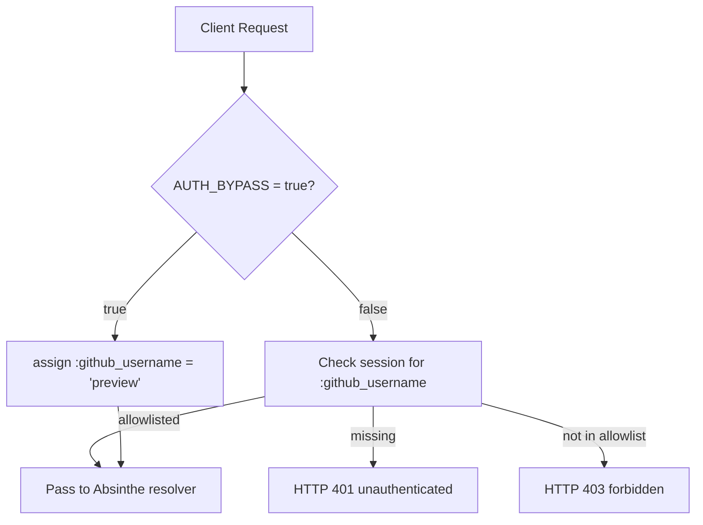

# Design — Unblock Prod Preview

## Context

Two bugs, two scopes, one deploy cycle. This design covers:

1. The minimal cleanup to unblock Railway's build pipeline (Chess removal).
2. The design of an authentication bypass escape hatch that's **safe-by-default**, **impossible to forget**, and **trivially reversible**.

## Architecture flow — auth under bypass

Key invariants encoded in the diagram:

- Bypass is checked **before** any session or allowlist logic. There is exactly one branch point.
- Under bypass, the session is **ignored entirely** — even if a real allowlisted user has a cookie, they are reassigned to `"preview"` identity for the request. This is intentional: bypass should not silently blend real and synthetic identities.
- The allowlisted path and the bypass path converge at the same resolver entry point. There is no downstream "bypass-aware" logic — bypass is invisible past `RequireOwner`.

## Decision log

### D1: Backend-authoritative, not frontend-only

**Alternative considered**: A Vite-time env var (`BYPASS_AUTH_UI=true`) that makes `SignInGate` short-circuit to render children, with no backend change.

**Rejected** because:
- `RequireOwner` would still 401 every GraphQL request, so the SPA would load but nothing would work — the preview would be hollow.
- Frontend-only flags are vulnerable to being accidentally left on in a cached bundle.
- The operator wants a *working* preview, not an empty shell.

**Chosen**: Backend reads the flag and both `RequireOwner` and `/auth/whoami` short-circuit. The frontend reacts to the backend's reported state via `auth_bypass: true` in the whoami response. One source of truth, auditable in one file (`runtime.exs`).

### D2: Env var name — `AUTH_BYPASS`

**Alternative considered**: `PREVIEW_MODE`, `DEMO_MODE`, `ALLOW_UNAUTHENTICATED`.

**Rejected** because:
- `PREVIEW_MODE` implies a feature, not a security escape hatch. Misleading.
- `DEMO_MODE` sounds like a benign showcase — dangerous in prod grep results.
- `ALLOW_UNAUTHENTICATED` is accurate but verbose and doesn't capture that this also bypasses the allowlist, not just authentication.

**Chosen**: `AUTH_BYPASS`. Explicit. Scary in a good way. Easy to grep for. Never gets mistaken for a feature flag.

### D3: Synthetic identity — `"preview"`

**Alternative considered**: `"admin"`, `"root"`, the operator's real username, a per-session UUID.

**Rejected** because:
- `"admin"` and `"root"` have implicit elevated-privilege connotations that don't apply here (the bypass grants *access*, not elevated *privileges* — every bypassed request has the same baseline access).
- Using the operator's real username would make bypassed traffic indistinguishable from real traffic in logs and library records.
- A per-session UUID makes every bypassed request a distinct "user", polluting the `library` and `chats` tables with ephemeral identities.

**Chosen**: Literal string `"preview"`. Reserved, non-user, clearly synthetic. Future code can guard against writes by `github_username == "preview"` if needed (not in this change — YAGNI).

### D4: Allowlist still loaded when bypass is on

When `AUTH_BYPASS=true`, `runtime.exs` still parses `GITHUB_ALLOWLIST` and populates `:perplexica, :github_allowlist`. The allowlist is simply unreferenced while bypass is active.

**Why**: flipping bypass off must be instantaneous. If we skipped loading the allowlist under bypass, turning bypass off would require a second redeploy to reload the allowlist. The current design lets the operator flip `AUTH_BYPASS=false` and have real auth work on the next request, no restart needed — Elixir's `Application.get_env/3` reads the stored value on each call.

### D5: Banner reads from whoami, not a separate endpoint

The Redwood frontend already calls `GET /auth/whoami` on mount via `SessionProvider`. Adding one field to that response is free.

**Alternative considered**: A separate `GET /auth/bypass-state` endpoint.

**Rejected** because:
- Adds a round-trip.
- Adds a second source of truth that could drift.
- The whoami response is already the session's canonical representation — `auth_bypass` belongs there.

### D6: Chess archival, not deletion

`tasks/archive/phoenix-legacy-smoke-test-ui/` is the established precedent for retired code in this repo (see `tasks/lessons.md` — the legacy Phoenix SPA lesson). Dead code that was exploratory but has visible craftsmanship gets archived with a README, not deleted.

`Chess.tsx` is 84 lines of a themed chess board with Unicode glyphs, color variants, and Tailwind styling. It's not crufty — it was a deliberate aesthetic exploration that didn't make it into the product. Archiving it (with a README pointing at this change) preserves the provenance and keeps the option open to revisit.

**Why no spec delta for the Chess archival**: moving dead code out of the build roots is maintenance, not a capability change. No user-visible behavior is modified (the `{false &&` gate meant it was already invisible in prod). OpenSpec's role is to capture behavior, not every file move.

### D7: Loud boot warning + persistent UI banner

The bypass has two redundant signals that it's on:

1. **Boot log** — `runtime.exs` logs a warning line whenever `AUTH_BYPASS=true`. Visible in `railway logs --deployment`.
2. **UI banner** — `PreviewModeBanner.tsx` renders a fixed-top strip whenever `auth_bypass: true` is in the whoami response. Visible on every page.

**Why two**: logs rotate and are easy to miss when you're in the middle of another task. A persistent UI banner means every time the operator looks at the app, they see that bypass is on. If either signal fails (log rotated, banner regressed), the other catches it.

## Trade-offs

| Dimension | Decision | Cost | Benefit |
|-----------|----------|------|---------|
| Breadth | Full-stack bypass (backend + frontend) | 2-3 files per side | Working preview, not a hollow shell |
| Safety | Explicit opt-in + loud signals | 5-10 lines of logging/UI | Impossible to silently leave on |
| Reversibility | Env var, not code toggle | Slightly more runtime state | Instant on/off, no redeploy for off |
| Scope | One synthetic identity, not a preview account system | No preview account management | YAGNI — we need one session, not a platform feature |
| Archival | Move Chess to `tasks/archive/`, don't delete | A few kilobytes in the repo | Preserves exploration, matches repo convention |

## Non-obvious details

- **Static import resolution at build time**: Vite resolves `lazy(() => import('...'))` specifiers statically, even when the call site is unreachable (`{false && <X />}`). The dead-code-elimination pass runs AFTER resolution, not before. This is why the `{false}` gate didn't save the Chess import from blocking the build — the lesson here is *"any `import(...)` specifier has to resolve at build time, period."*
- **Why the last SUCCESS deploy at `03:09:48` slipped through**: it was built via `railway up --detach`, which uploads the local working directory (including untracked `Chess.tsx`). Every deploy since then has been triggered from GitHub integration, which only sees tracked files. Confirmed via `railway deployment list` timestamps correlating with git commit times.
- **Session renewal under bypass**: because bypass short-circuits before any `put_session`/`configure_session` call, bypassed requests do not rotate the session cookie. This is intentional — we don't want bypassed traffic to affect real session state.
- **`/auth/github/callback` under bypass**: still works normally. A real user can complete OAuth while bypass is on, and the session will be stored. Under bypass, that session just never gets read — the plug overrides it. When bypass is flipped off, the stored session becomes active again on the next request. Clean switch-over without a forced sign-in.
